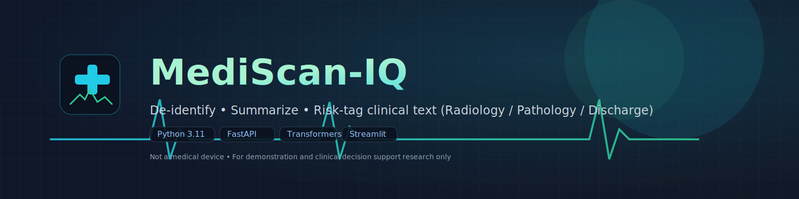

<!-- Hero banner -->
<p align="center">
  
</p>

# MediScan-IQ

**De-identify clinical text, summarize findings, and tag case risk (low / moderate / high)** — via CLI, REST API, or Streamlit.

> **Not a medical device.** For demonstration and clinical decision support research only.

---

## What it does

1. **Ingest & validate** clinical text (radiology / pathology / discharge / ecg / echo / others).  
2. **PHI anonymization** (emails, phones, MRNs/IDs, address & name hints, dates\*).  
3. **Sentence splitting** for downstream NLP.  
4. **Summarization** (abstractive): 2–3 sentence summary of key findings.  
5. **Risk tagging** (hybrid): **NLI model** + **heuristics** → `low | moderate | high` with probabilities.  
6. **Explainability**: UI highlights risk-related keywords; meta includes model names/modes & PHI counts.

\* Date redaction is configurable.

---

## Features

- **Three interfaces:** `CLI` • `REST API (FastAPI)` • `Streamlit` web app  
- **PHI handling:** mask or salted-hash; counts reported in responses  
- **Models (baseline):**
  - **Summarizer:** `google/flan-t5-base`
  - **Risk NLI:** `facebook/bart-large-mnli` (configurable)
- **Config via `.env`** (limits, model names, thresholds, device)
- **CPU-only friendly**; optional CUDA/MPS if available

---

## Tech stack

**Language & Runtime**
- Python **3.9+** (tested on 3.11), CPU-first with optional **CUDA/MPS** via PyTorch

**Core Libraries**
- **FastAPI** + **Uvicorn** — REST API server
- **Typer** — CLI entrypoints
- **Pydantic v2** + **pydantic-settings** — schema & config management
- **regex**, **nltk**, **langdetect**, **numpy** — preprocessing, sentence split, language hints

**NLP / Models (Hugging Face)**
- **transformers**, **torch**, **accelerate**, **sentencepiece**
- **Summarizer:** `google/flan-t5-base` (abstractive)
- **Risk Tagger (NLI):** `facebook/bart-large-mnli` (zero-shot label probabilities)
- **scikit-learn** — small utilities (e.g., softmax/normalization if needed)

**UI**
- **Streamlit**, **Altair**, **pandas** — interactive web app, charts, and tables

**Build & Quality**
- **pyproject.toml** (setuptools) — packaging
- Optional dev extras: **pytest**, **pytest-cov**, **ruff**, **mypy**

**Storage/State**
- Stateless API; models cached locally by `transformers` in the user HF cache

---

## Quickstart

### Windows (PowerShell)

```
# 1) Project root
Set-Location C:\path\to\mediscan-iq

# 2) Create & activate venv
py -3.11 -m venv .venv
.\.venv\Scripts\Activate.ps1
python -m pip install -U pip wheel setuptools

# 3) Install package (editable) + dev extras
pip install -e .[dev]

# 4) NLTK punkt (once)
python - <<'PY'
import nltk; nltk.download('punkt'); print("punkt ready")
PY
```

### macOS / Linux

```
cd /path/to/mediscan-iq
python3 -m venv .venv
source .venv/bin/activate
python -m pip install -U pip wheel setuptools
pip install -e .[dev]
python - <<'PY'
import nltk; nltk.download('punkt'); print("punkt ready")
PY
```

### .env configuration

Copy the example and adjust values:

```
cp .env.example .env
```

Most baselines declare `accepted_report_types` as a **List[str]** in `config.py`, so use **JSON** in `.env`:

```
# Server
API_HOST=0.0.0.0
API_PORT=8000

# Limits
MAX_CHARS=20000

# Accepted report types (JSON array)
ACCEPTED_REPORT_TYPES=["radiology","pathology","discharge","ecg","echo","others"]

# PHI
ANONYMIZE_STRATEGY=hash      # mask | hash
MASK_CHAR=█
HASH_SALT=mediscan
KEEP_DATES=false
REDUCE_WHITESPACE=true

# Models
SUMMARIZER_MODEL=google/flan-t5-base
RISK_NLI_MODEL=facebook/bart-large-mnli
RISK_THRESHOLD_HIGH=0.64
RISK_THRESHOLD_MODERATE=0.42

# Runtime
DEVICE_PREFERENCE=auto       # auto | cpu | cuda | mps
SEED=42
```

> If your `config.py` uses a `*_raw` CSV string with a parsing property, change `ACCEPTED_REPORT_TYPES` to:
> `radiology,pathology,discharge,ecg,echo,others`.

---

## CLI usage

```
# Ingest (validate + anonymize + split)
python -m mediscan_iq.cli ingest .\sample_data\example_radiology.txt -t radiology

# Summarize (anonymize → abstractive summary)
python -m mediscan_iq.cli summarize .\sample_data\example_radiology.txt -t radiology

# Risk tagging (anonymize → NLI + heuristics)
python -m mediscan_iq.cli risk .\sample_data\example_radiology.txt

# Full pipeline (anonymize → split → summarize → risk)
python -m mediscan_iq.cli analyze .\sample_data\example_radiology.txt -t radiology
```

If installed as a console script:

```
mediscan-iq analyze path/to/report.txt -t radiology
```

---

## REST API

### Run server

```
python -m uvicorn mediscan_iq.api:app --host 0.0.0.0 --port 8000 --reload
```

Health probe:

```
Invoke-RestMethod http://localhost:8000/health
```

### Endpoints

* `GET /health` → `{"status":"ok","version":"<semver>"}`
* `POST /ingest` → anonymized text, sentences, PHI counts
* `POST /analyze` → summary, risk level + probabilities, anonymized text, sentences, meta

### Example requests

**PowerShell — `/ingest`**

```
$body = @{ text = "Patient John Doe ..."; report_type = "radiology" } | ConvertTo-Json
Invoke-RestMethod -Uri "http://localhost:8000/ingest" -Method Post -ContentType "application/json" -Body $body
```

**PowerShell — `/analyze` (multi-line)**

```
$text = @"
FINDINGS: Mild cardiomegaly. No acute pulmonary edema or effusion.
IMPRESSION: Cardiomegaly without acute cardiopulmonary process.
"@
$body = @{ text = $text; report_type = "radiology" } | ConvertTo-Json -Depth 4
Invoke-RestMethod -Uri "http://localhost:8000/analyze" -Method Post -ContentType "application/json" -Body $body
```

**curl — `/analyze`**

```
curl -s -X POST http://localhost:8000/analyze \
  -H "Content-Type: application/json" \
  -d '{"text":"FINDINGS: Mild cardiomegaly. IMPRESSION: No acute disease.","report_type":"radiology"}'
```

---

## Streamlit app (optional)

```
pip install streamlit altair pandas
streamlit run .\app_streamlit.py
```

* Paste or upload a note → click **Analyze**.
* See **summary**, **risk badge**, **probability chart**, **anonymized text with highlights**, and **meta**.

---

## Realistic test cases

Create files quickly (PowerShell):

```
@'
FINDINGS: Mild cardiomegaly. No acute pulmonary edema or pleural effusion.
IMPRESSION: Cardiomegaly without acute cardiopulmonary process.
'@ | Set-Content .\CXR_mild_cardiomegaly.txt -Encoding UTF8

@'
FINDINGS: Acute subarachnoid hemorrhage within the suprasellar cisterns and anterior interhemispheric fissure.
IMPRESSION: Acute subarachnoid hemorrhage. Urgent neurosurgical evaluation recommended.
'@ | Set-Content .\HeadCT_SAH.txt -Encoding UTF8

@'
HISTORY: Fever, productive cough.
FINDINGS: New right upper lobe air-space consolidation with air bronchograms.
IMPRESSION: Right upper lobe pneumonia. Recommend therapy.
'@ | Set-Content .\CXR_RUL_pneumonia.txt -Encoding UTF8

@'
ADMISSION: Acute decompensated heart failure with volume overload.
COURSE: IV diuresis net -2.5L in 48h; renal function improved; EF 40-45%; small pleural effusions.
DISCHARGE: Furosemide 40 mg, Spironolactone 25 mg, low-sodium diet, cardiology follow-up.
'@ | Set-Content .\Discharge_ADHF_long.txt -Encoding UTF8
```

---

## Success criteria

* **CXR_mild_cardiomegaly** → Summary mentions *mild cardiomegaly; no acute process*. Risk typically **moderate** (keyword “cardiomegaly”) or **low** if thresholds stricter—OK if the summary is correct.
* **HeadCT_SAH** → Summary includes *acute subarachnoid hemorrhage*. **Risk = high**; `high risk` probability on top.
* **CXR_RUL_pneumonia** → Summary includes *RUL pneumonia / consolidation*. **Risk = moderate**; `moderate risk` on top.
* **Discharge_ADHF_long** → Summary captures *ADHF, diuresis, EF ~40–45%, small effusions, meds*. **Risk = moderate** (may be low if conservative). Summary should remain coherent despite length.

Focus on **correct clinical concepts** and **top-ranked risk bucket** rather than exact probability numbers.

---

## Performance tips

* First run downloads models; subsequent runs are fast.
* CPU-only works; set `DEVICE_PREFERENCE=cuda` if you have a GPU.
* For richer summaries, increase:

  * `SUMMARIZER_MAX_OUTPUT_TOKENS=160`
  * `SUMMARIZER_NUM_BEAMS=6` (when using seq2seq)
* For stricter triage tuning:

  * `RISK_THRESHOLD_HIGH=0.58–0.65`
  * `RISK_THRESHOLD_MODERATE=0.40–0.50`

---

## Troubleshooting

* **`BaseSettings has moved to pydantic-settings`**
  Install & update import:

  ```powershell
  pip install pydantic-settings
  ```

  In `config.py`:

  ```python
  from pydantic_settings import BaseSettings
  ```

* **`Unsupported report type` even though value looks correct**
  Check `.env` format for `ACCEPTED_REPORT_TYPES`:

  * If `List[str]` field → **JSON array**
  * If `*_raw: str` + property → **CSV**

* **`422 Unprocessable Entity` on `/analyze`**
  Ensure JSON body has both fields and correct header:

  ```json
  {"text":"...","report_type":"radiology"}
  ```

* **“temperature ignored” notice**
  Harmless on some HF models; disappears if temperature is only passed when sampling.

---

## Security & privacy

* The anonymizer removes common PHI **heuristically** (emails, phones, dates*, IDs, name/address hints).
* Do **not** ingest directly identifiable patient data without reviewing your PHI policy.
* This repository is **not a medical device**; clinicians remain responsible for decisions.

---

## License

This project is licensed under MIT License.

---

### Maintainers

* Abdulvahap Mutlu — *MediScan-IQ*
